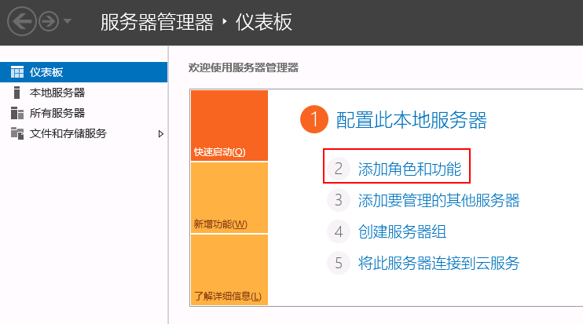
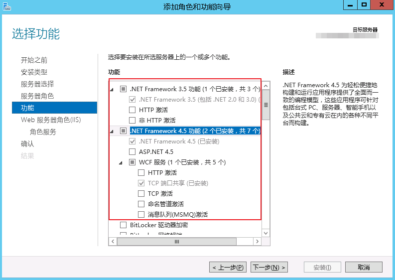
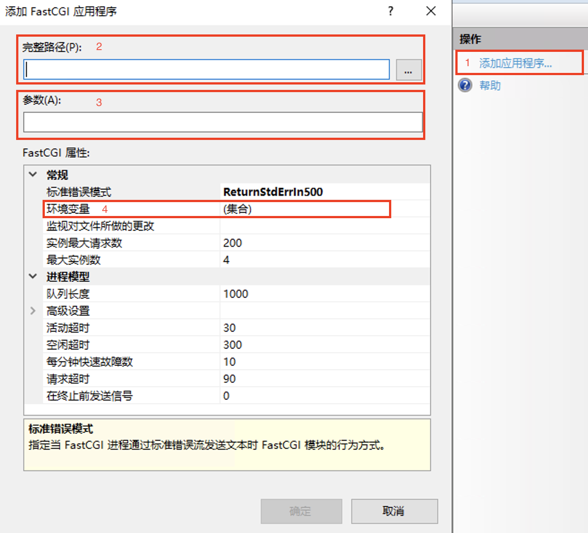

# 基于Django与IIS搭建网站手册

## 1 工具介绍
### 1.1 硬件
个人电脑，服务器
### 1.2 软件
Anaconda、PyCharm、MySQL、Microsoft Remote Desktop 与 Microsoft Internet Information Services (IIS)
### 1.3 其他
域名

## 2 购买域名及服务器
### 2.1 购买地址
腾讯云、阿里云、华为云等都可以购买域名（也存在免费的具有特殊后缀名的域名）及服务器（轻量化服务器、云服务器等）。

### 2.2 注册域名
注册完域名之后，首先要了解几个基础知识，以下通过一个简单的例子进行说明：

如，已经注册了一个域名ding.cn，这个域名是一级域名，可以在这个域名下挂靠一个网站，如自己的个人主页。
此外，也可以在一级域名下解析多个二级域名，如 map.ding.cn、study.ding.cn 等，每个二级域名都可以挂靠一个网站，如自己开发的一些小应用等。
并且这些网站的代码都可以部署在同一个服务器上。

### 2.3 购买服务器
如果需求不高，如仅用于部署个人主页及提供一些简单的 web 服务等，建议购买轻量化服务器（便宜一点）。

## 3 网站本地开发与测试
### 3.1 部署开发环境

安装 Anaconda：https://www.anaconda.com/

安装 PyCharm Community：https://www.jetbrains.com/zh-cn/pycharm/

安装 MySQL Community：https://www.mysql.com/downloads/ ，安装之后记住，账户：root；密码：xxxxxx。

### 3.2 安装Django环境
打开 PyCharm ，新建一个工程，新建一个 Conda 环境（建议选择Python 3.6），如下图所示：

在 PyCharm 中的终端中输入 pip install django 以安装 django（也可以打开终端，进入 .../anaconda/envs/ 目录下，输入 activate MyWebsite，然后 pip install django ）

### 3.3 Django开发的基本知识

### 3.3.1 基于Django的网站基本框架
在 PyCharm 终端输入：

    django-admin startproject Website
即搭建了一个空网站，接着进入 Website 目录下，并测试网站是否搭建成功：
    
    python manage.py runserver
用浏览器打开 http://127.0.0.1:8000/， 如果出现以下画面即成功。

接下来我们给这个网站添加一些功能，如添加 app，输入以下：

    python manage.py startapp app1
即在网站中搭建了一个 app 组件，名为 app1 。一个网站往往由多个 app 构成，每个 app 都是为了实现某一种功能，如用户中心，可视化等等。

此时我们可以看到整个工程的基本目录：

下一步，需要链接 app1 与 Website，在 Website 目录下的 settings.py 中的 INSTALLED_APPS 这一列表的最后添加上 'app1' ，即新增加的 app 的名字。

接下来我们在 app1 目录下添加两个文件夹，分别是 templates 与 static。templates 文件夹下一般保存 html 文件， 
static 文件夹下又可以细分称 css，js，img，data，plugins等文件夹，具体功能就不叙述了。

### 3.3.2 语法与基本功能实现
html, css, js 的语法这里就不介绍了。

django 可以从后台将 content 传到前端 html（在  中可以写 python 语法，在 {{ }} 中写变量）。

### 3.3.3 数据库功能实现
首先开启MySQL，打开终端，进行如下操作：
    
    net start mysql # 开启 MySQL
    net stop mysql  # 关闭 MySQL

确保MySQL功能开启后，在终端输入：
    
    mysql -u root -p
并输入密码，即可登陆。登陆之后建立一个用于这一网站工程的数据库，假设取名为MyWebsite：
    
    create database MyWebsite DEFAULT CHARSET utf8 COLLATE utf8_general_ci;

自此数据库构建成功。

下一步，将数据库链接到网站中，在settings.py中改写DATABASES这一变量为如下：

    DATABASES = {
        'default': {
            'ENGINE': 'django.db.backends.mysql',
            'NAME': 'MyWebsite',
            'USER': 'root',
            'PASSWORD': 'xxxxxx',
            'HOST': '127.0.0.1',
            'PORT': 3306,
        }
    }

<b><i>如果你的个人电脑是windows的系统，你需要在 MyWebsite 环境中安装 pymysql ，安装方法与安装 django 相同。</i></b>

接下来，定义数据表的对象和结构。比如，我们就定义一个叫房子的对象，具有五个属性，可以在model.py文件中写入如下：

    from django.db import models

    class House(models.Model):
        owner = models.CharField(max_length=20)
        address = models.CharField(max_length=50)
        area = models.FloatField()
        price = models.FloatField()

最后，通过 PyCharm 中的终端输入以下，将数据结构写入到数据中：

    python manage.py makemigrations
    python manage.py migrate 

### 3.4 本地网站测试
在 PyCharm 的终端中输入以下，并通过浏览器打开 http://127.0.0.1:8000/，对网站进行本地测试。

    python manage.py runserver

## 4 开通 IIS 服务及网站部署
### 4.1 开通 IIS
打开服务器管理器，在“快速启动”栏，单击“添加角色和功能”。

    

IIS 设置如下：

    
    
    

### 4.2 软件安装及环境配置
同"网站本地开发与测试"一样，分别安装 Anaconda、PyCharm 和 MySQL 。

### 4.3 网站测试
将在本地搭建的网站这一工程上传到远程服务器上，如直接放到C盘目录下（C:\Website\MyWebsite），并将本地的 .../anaconda/envs/MyWebsite 文件夹对应上传到一样的位置（C:\anaconda\envs\MyWebsite）。

用 PyCharm 打开 C:\Website\MyWebsite，并按照 3.3.3 重新配置数据库。输入以下命令以运行该工程：
    
    python manage.py runserver

### 4.4 网站部署

Step 1: 如下图所示，在"网站"下添加站点

    

其中，1 输入 C:\Website\MyWebsite；2 输入所购买的域名；3 添加 SSL 证书（在对应的服务商上申请免费的 SSL 证书即可）

Step 2: 安装 wfastcgi（安装方法与安装 django 相同）, 并在 C:ProgramData\Anaconda3\envs\MyWebsite\Lib\site-packages\wfastcgi.py 拷贝到 C:\Website\MyWebsite 目录中。

Step 3: 在 C:\Website\MyWebsite 中添加一个 web.config 文件，并输入以下：

    <?xml version="1.0" encoding="UTF-8"?>
    <configuration> 
        <system.webServer>
            <handlers>
                <add name="Python FastCGI" path="*" verb="*" modules="FastCgiModule" scriptProcessor="C:ProgramData\Anaconda3\envs\MyWebsite\python.exe|C:\Website\MyWebsite\wfastcgi.py" resourceType="Unspecified" />
            </handlers>
        </system.webServer>
    </configuration>

Step 4: 在 IIS 根节点找到 FastCGI 设置，点击 1 以添加新的应用程序。

    

在 2 中输入 C:ProgramData\Anaconda3\envs\MyWebsite\python.exe；在 3 中输入 C:\Website\MyWebsite\wfastcgi.py；在 4 中输入以下：

| Name |                  Value                  |
| :------: |:---------------------------------------:|
| WSGI_HANDLER | django.core.wsgi.get_wsgi_application() |
| PYTHONPATH |                 C:\Website\MyWebsite                 |
| DJANGO_SETTINGS_MODULE |           MyWebsite.settings            |

Step 5: 添加静态文件夹。在 settings.py 的最后添加以下代码：

    #*********************************发布IIS 必须添加的代码***************************************************
    SITE_ROOT = os.path.abspath(os.path.dirname(__file__))
     
    STATIC_URL = '/static/'
     
    STATIC_ROOT = os.path.join( SITE_ROOT, 'static')
    SITE_STATIC_ROOT = os.path.join( SITE_ROOT, 'local_static')
     
    # Additional locations of static files
    STATICFILES_DIRS = (
        # Don't forget to use absolute paths, not relative paths.
        ('', SITE_STATIC_ROOT),
    )
    #************************************************************************************
在 settings.py 同级目录下添加名称为 local_static 的目录，并在 local_static  目录中添加 web.config 内容如下：

    <?xml version="1.0" encoding="utf-8"?>
    <configuration>
      <system.webServer>
        <!-- this configuration overrides the FastCGI handler to let IIS serve the static files -->
        <handlers>
          <clear/>
          <add name="StaticFile" path="*" verb="*" modules="StaticFileModule" resourceType="File" requireAccess="Read" />
        </handlers>
      </system.webServer>
    </configuration>
在项目根目录下面运行代码

    python manage.py collectstatic

Step 6: 在 IIS 服务中，在"网站->MyWebsite"下添加虚拟文件目录 static，地址为 C:\Website\MyWebsite\MyWebsite\static

## 5 解答一些疑惑
### 5.1 为什么要用 Django 和 Microsoft IIS？
首先，Django 入门不难，而且功能强大，逻辑就是 Python 的逻辑。其次，Linux 服务器我用的不好，指令老是记不住，所以就把网站服务器设成了 Windows 系统。
自然而然就用了 Microsoft IIS。

### 5.2 为什么不直接 Microsoft Remote Desktop 连接远程服务器，直接在远程服务器上完成软件、环境、项目搭建、测试、部署呢？
如果你购买的服务器性能很好，那就不存在这个问题。我购买的是轻量化服务器，还是 2 核的，在上面写代码很卡，所以倾向于在个人电脑上做完大部分事情。

### 5.3 为什么非要搭建一个 Conda 环境并建议选择 Python=3.6 呢？
当同时部署多个网站，每个网站都需要一个独立的托管环境（Python）。此外，Python3.6 兼容性好。

## 6 联系方式
这份文档基于个人的一些经验，也可能存在一些错误和不足。如果有疑问和建议，麻烦您反馈给我（dylan_lyu@sjtu.edu.cn），谢谢。

